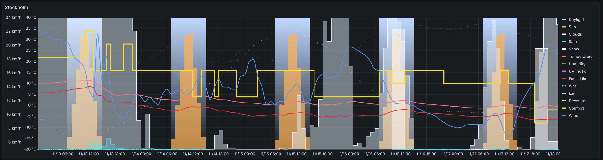
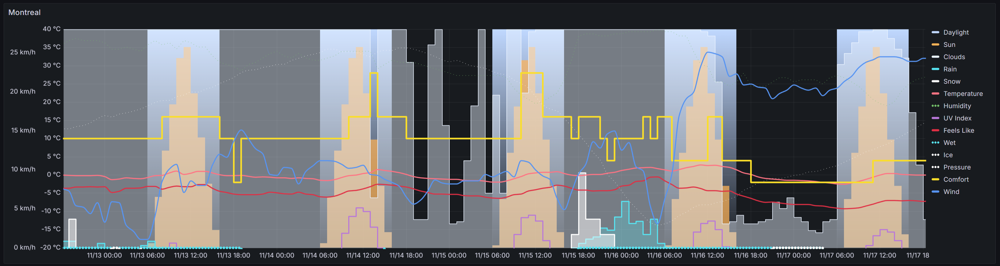
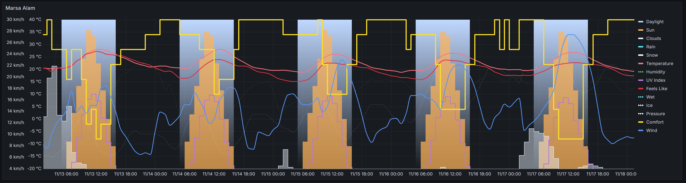
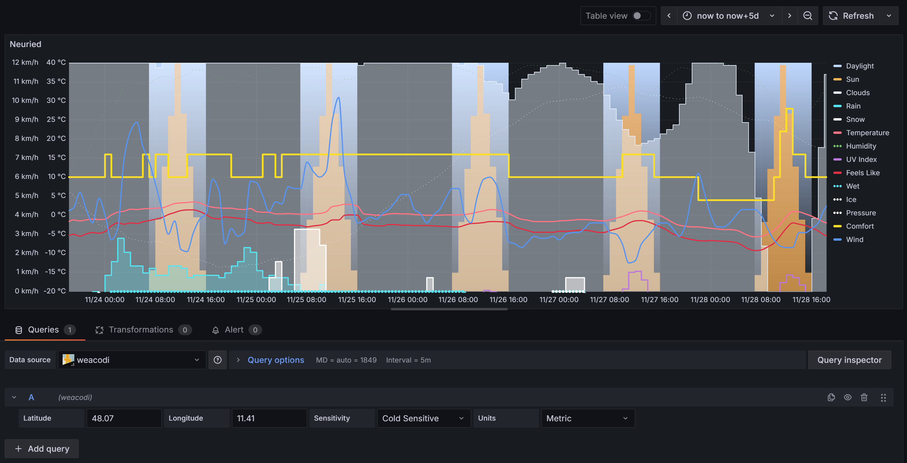

# Weacodi Grafana Plugin

[](https://www.gnu.org/licenses/agpl-3.0)
[](https://creativecommons.org/licenses/by-sa/4.0/)

**Important Note**

This plugin is **fully functional** and actively used in production on [weacodi.com](https://weacodi.com) as a live demonstration of the original **Weather Comfort Diagram (Weacodi™)** method.

The plugin is **not listed** in the official Grafana plugins catalog due to unresolved differences regarding the preferred licensing file structure and plugin type requirements.

**You can still install and use the plugin**:

- Download the latest release as a ZIP archive from the [Releases page](https://github.com/weacodi/weacodi-grafana-plugin/releases) and install it via Grafana UI  
  (`Configuration → Plugins → Install plugin`)
- Or build it from source following the instructions below

The plugin provides:
- A datasource that fetches weather data from Open-Meteo and calculates comfort score, feels-like temperature, sensitivity flags and other derived parameters
- A custom panel rendering the unique multi-layer **Weather Comfort Diagram**
- Example dashboard

For questions, installation help, feature requests or suggestions – feel free to [open an Issue](https://github.com/weacodi/weacodi-grafana-plugin/issues) or write to weacodi@gmail.com.

---


This repository ships the official Grafana implementation of the **Weather
Comfort Diagram (Weacodi™)** — a datasource + panel combo that draws the
multi-layer comfort chart directly inside Grafana dashboards by fetching data
from [Open-Meteo](https://open-meteo.com) via the Grafana data proxy (no custom
backend required).
Weacodi is an alternative way to visualize the weather forecast, letting you
assess atmospheric conditions in one second without parsing numeric tables with
icons. The layered diagram shows daylight, sun, clouds, rain, snow, wind, comfort
score,wet/ice flags, and pressure in a single glance.







Panel editing view with query parameters (datasource `weacodi`, latitude/longitude, sensitivity, units):



## Stack overview

```
weacodi-weacodi-app/         Grafana app plugin (datasource + panel)
docs/                         Weacodi concept PDF
```

## Quick start

1. **Clone and prepare**
   ```bash
   git clone https://github.com/weacodi/weacodi-grafana-plugin.git
   cd weacodi-grafana-plugin
   nvm install 22 && nvm use 22
   ```
2. **Build the plugin**
   ```bash
   cd weacodi-weacodi-app
   npm install
   npm run build
   ```
3. **Start Grafana with the plugin mounted**
   ```bash
   npm run server            # or: docker compose up
   ```

Grafana becomes available at <http://localhost:3000> (default login `admin` / `admin` for a clean install). The provided Docker Compose stack
auto-provisions a datasource named `weacodi`, so the dashboards included with this repo start working immediately. If you deploy
the plugin in another Grafana instance, create a datasource of type “Weacodi” and name it `weacodi` (no settings required — it connects to the
public Open-Meteo API). Enabling the app auto-imports the bundled dashboard **Weacodi – Overview** from
`dashboards/weacodi_overview.json` inside the plugin bundle. You can also import it manually via *Dashboards → Import* if needed.

## Packaging for Grafana plugin catalog

To produce a catalog-ready archive, run:

```bash
cd weacodi-grafana-plugin/weacodi-weacodi-app
npm run build
cd ..
./scripts/package.sh
```

This creates `weacodi-weacodi-app-<version>.zip` at the repo root. The archive contains a top-level `weacodi-weacodi-app/` directory (as required by Grafana plugin validation) with the production bundle inside.

## Query parameters

Each dashboard panel stores a Weacodi query with the following knobs (mapped
directly to Open-Meteo request parameters):

| Param | Required | Description |
| ----- | -------- | ----------- |
| `lat`, `lon` | ✅ | Coordinates (-90…90 / -180…180) |
| `days` | ❌ | Forecast window 1‑16 (default 16 + previous 24h) |
| `sensitivity` | ❌ | `normal`, `heatSensitive`, `coldSensitive` |
| `units` | ❌ | `metric` (default), `imperial`, `nautical` |

The datasource processes the Open-Meteo payload locally to produce the layered
arrays (`daylight`, `sun`, `clouds`, `rain`, `snow`, `temperature`, `humidity`,
`uv`, `feelsLike`, `wet`, `ice`, `pressure`, `comfort`, `wind`). Field
descriptions live in [USER_GUIDE.md](USER_GUIDE.md).

## Licensing & attribution

| Component | License | Notes |
| --- | --- | --- |
| Plugin code (`weacodi-weacodi-app/`, dashboards) | [AGPL-3.0-only](weacodi-weacodi-app/LICENSE) | Share-alike for the Grafana plugin code. |
| Weather Comfort Diagram concept, diagrams, content, documentation (`docs/weacodi-concept.pdf`) | [CC BY-SA 4.0](docs/LICENSE) | Share-alike for Weacodi concept and documentation. |
Provide attribution by linking to weacodi.com or weacodi.github.io/weacodi/ and referring to the concept as “Weather Comfort Diagram” or “Weacodi” and Author names.

## Authors & contact

- Authors: Oleksii Zubovskyi and Olena Zubovska
- Email: [weacodi@gmail.com](mailto:weacodi@gmail.com), [zubovsky@gmail.com](mailto:zubovsky@gmail.com)
- Website: <https://weacodi.com>
- Github Pages: <https://weacodi.github.io/weacodi/>

## More docs

- [INSTALL.md](INSTALL.md) – detailed Docker/manual deployment.
- [USER_GUIDE.md](USER_GUIDE.md) – dashboard overrides, API parameters, tips.
- [docs/weacodi-concept.pdf](docs/weacodi-concept.pdf) – full diagram spec.
- [Open-Meteo docs](https://open-meteo.com/en/docs) – upstream forecast API.
