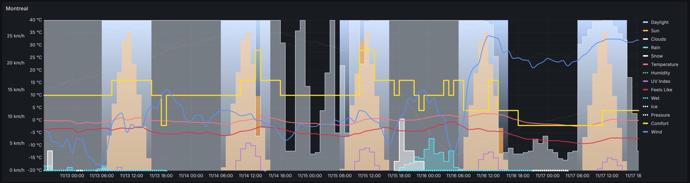
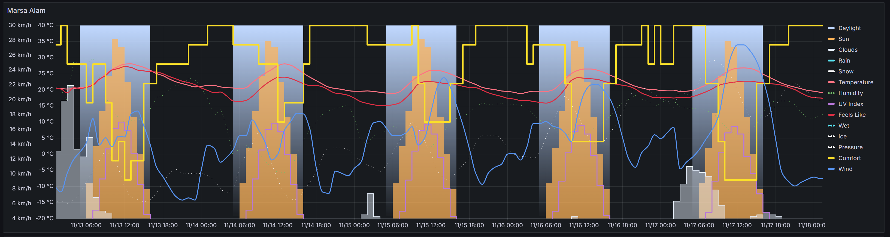

# WeaCoDi Grafana Plugin

This repository ships the official Grafana implementation of the **Weather
Comfort Diagram (WeaCoDi™)** — a datasource + panel combo with a Fastify API
that draws the multi-layer comfort chart directly inside Grafana dashboards.
Instead of juggling multiple weather panels, operators and outdoor teams get a
single glance view of daylight, rain, snow, wind, comfort score, wet/ice flags,
and other derived metrics.






## Stack overview

```
weacodi-core-api/
  Fastify service fetching Open-Meteo data, applying WeaCoDi transforms, caching in Redis

weacodi-weacodi-app/
  Grafana app plugin:
    • backend datasource (Go) that talks to the API
    • React panel rendering the layered diagram
    • provisioning (datasource, dashboard exports)

docs/
  LICENSE (CC BY-SA 4.0 text)
  weacodi-concept.pdf (diagram specification)
```

## Quick start

1. **Clone and prepare**
   ```bash
   git clone https://github.com/weacodi/weacodi-grafana.git
   cd weacodi-grafana
   nvm install 22 && nvm use 22
   ```
2. **Build the plugin**
   ```bash
   cd weacodi-weacodi-app
   npm install
   $(go env GOPATH)/bin/mage -v   # backend binaries
   npm run build                  # frontend panel
   ```
3. **Install API deps**
   ```bash
   cd ../weacodi-core-api
   npm install
   ```
4. **Run the full stack**
   ```bash
   docker compose up --build
   ```

Grafana becomes available at <http://localhost:3000> (admin / `weacodi`). The
datasource and dashboards are auto-provisioned; pick a location override or use
the provided multi-city board.

## API synopsis

```
GET /api/v1/weather?lat=48.09&lon=11.49&units=metric
```

| Param | Required | Description |
| ----- | -------- | ----------- |
| `lat`, `lon` | ✅ | Coordinates (-90…90 / -180…180) |
| `days` | ❌ | Forecast window 1‑16 (default 16 + previous 24h) |
| `sensitivity` | ❌ | `normal`, `heatSensitive`, `coldSensitive` |
| `intensity` | ❌ | Cycling effort profile `0`…`2` |
| `units` | ❌ | `metric` (default), `imperial`, `nautical` |

Response arrays cover `daylight`, `sun`, `clouds`, `rain`, `snow`, `temperature`,
`humidity`, `uv`, `feelsLike`, `wet`, `ice`, `pressure`, `comfort`, `wind`.
Field descriptions live in [USER_GUIDE.md](USER_GUIDE.md).

## Licensing

We keep software and methodology under separate communities-friendly licenses.

| Component | License | Notes |
| --- | --- | --- |
| Plugin + API code (`weacodi-weacodi-app/`, `weacodi-core-api/`, dashboards) | [GNU AGPL v3](LICENSE) | Guarantees share-alike even for hosted Grafana/SaaS deployments. |
| WeaCoDi™ concept, diagrams, documentation (`docs/weacodi-concept.pdf`) | [CC BY-SA 4.0](docs/LICENSE) | Ensures attribution to **Oleksii Zubovskyi & Olena Zubovska** and share-alike for visual adaptations. |

Trademark notice: “WeaCoDi”, “Weacodi”, “weacodi”, and stylized variants are
claimed as trademarks by Oleksii Zubovskyi & Olena Zubovska. Use the name
descriptively (“powered by Weacodi”), but do not rebrand your product without
permission.

## Authors & contact

- **Oleksii Zubovskyi & Olena Zubovska**
- Email: [weacodi@gmail.com](mailto:weacodi@gmail.com)
- Website: <https://weacodi.com>

## More docs

- [INSTALL.md](INSTALL.md) – detailed Docker/manual deployment.
- [USER_GUIDE.md](USER_GUIDE.md) – dashboard overrides, API parameters, tips.
- [docs/weacodi-concept.pdf](docs/weacodi-concept.pdf) – full diagram spec.
- [Open-Meteo docs](https://open-meteo.com/en/docs) – upstream forecast API.
